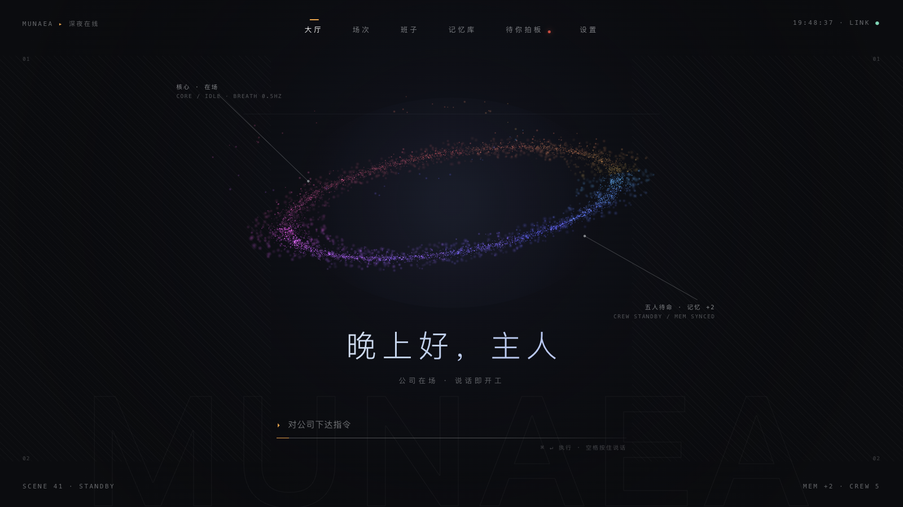
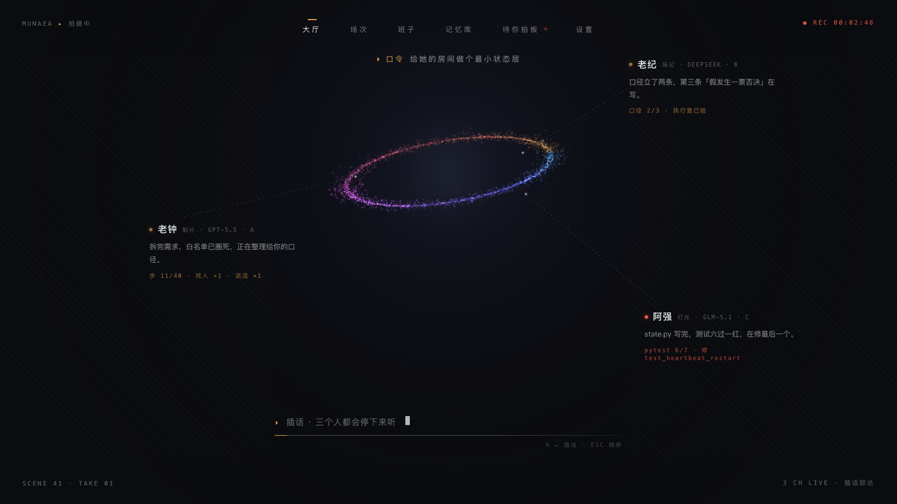
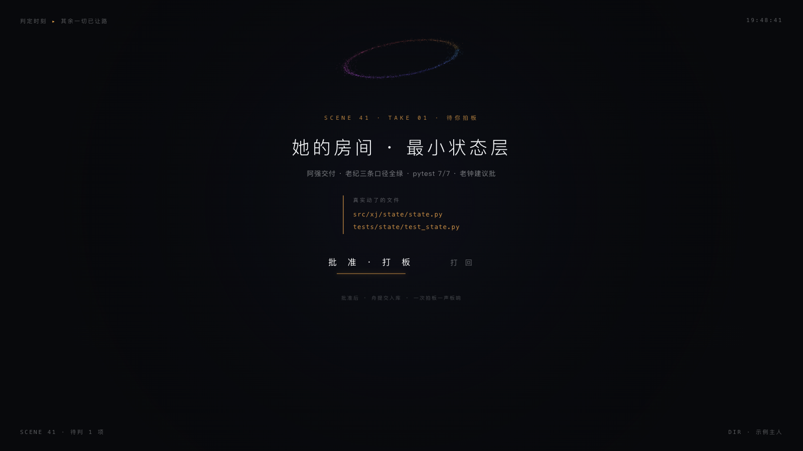
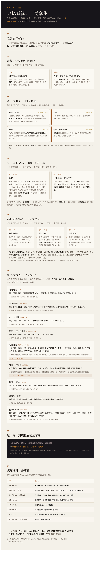
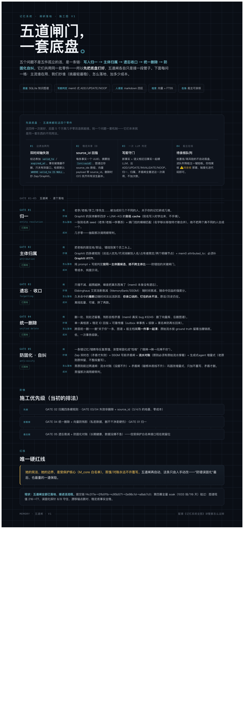

# 沐光破事部 · Muguang Bureau



> 一个把多模型协作、组织制度、长期记忆、可视化工作现场、交付验收与恢复机制放在一起的开源 AI 工作组织平台。

沐光破事部不是“给聊天机器人套一层网页”。它把 AI 当作一组有岗位、有职责、有权限、有记忆、有工作记录的协作成员；人仍然是最终决策者，平台负责让协作可见、可追踪、可干预、可恢复。

## 当前版本

- 正式源码快照：**暮光 v1.2.2 beta**
- 发布基线：`76a6278`
- 源码规模：490 个文件，约 12 MB
- 当前正式快照已通过：Python 语法、结构契约、公司回归、多用户单元测试、前端依赖安装、前端生产构建、启动脚本与备份脚本检查

这里写的是正式发布快照，不是开发目录，也不是早期 GitHub 候选。开发中的新改动不会自动混进这个版本。

## 它到底是什么

这是一个面向长期工作的 **AI 工作组织运行时**（runtime，指负责实际运行协作流程的程序），包含：

- **岗位化多 Agent**：项目经理、首席工程师、工程师、测试工程师、文案工程师各自有职责、权限和工作边界。
- **真正的协作语义**：需要时开会、互相听取、质疑、澄清、派活、回收结果；平台不把模型强行改造成同一种工作方式。
- **长期记忆治理**：原话、当前事实、原则、待确认内容、向量检索与图谱索引分层保存。
- **可视化工作现场**：大厅、场次、班子、记忆库、待你拍板等视图，让用户看到“谁在做什么、做到哪一步、哪里需要决定”。
- **任务与交付闭环**：任务登记、权限白名单、过程记录、文件验收、内容校验、返工与归档。
- **多用户隔离**：不同实例拥有独立账户、记忆、工作区和运行状态；源码、实例数据和模型凭据分开。
- **失败可见、状态可恢复**：事件先落盘再广播，运行身份、版本边界、重启、备份和恢复都有明确路径。

## 真实预览

### 大厅：不是聊天框，是工作现场


中心光环对应当前工作场；成员、岗位、记忆同步状态和输入入口都在同一画面里。视觉设计不是装饰，它服务于“看见组织状态”。

### 协作：成员各自工作，结果回到现场



画面会呈现岗位、模型、当前动作、工作进度和可插话入口。用户可以继续观察，也可以在关键处介入。

### 验收：交付不是模型说“完成”就算完成



待验收页面把交付文件、验证结果、批准与打回放到同一个决策点，避免“看起来完成”和“真的可交付”混为一谈。

## 我们真正解决的难题

### 1. 从“多个模型”变成“一个组织”

普通多 Agent 项目通常停在路由和编排：把问题分给几个模型，再把答案拼起来。这里继续往下做了岗位制度、固定汇报链、权限边界、任务登记、交付门和责任归属。模型可以并行，也可以各自采用不同工作习惯；平台只约束它能做什么、过程是否可见、结果是否可验收。

### 2. 让会议有信息增量，而不是多人轮流复读

会议不是把同一条提示词广播给所有模型。系统区分听取、回应、反对、澄清、派活和收口；只有真正形成协作需求时才开会，会议结果要能回到任务、决策和记忆中。

### 3. 把长期记忆从“摘要文件”提升为可治理系统

记忆不是越多越好，也不是把每次对话压成一段摘要。当前设计把记忆分为原始流水、当前状态、长期原则、个人记忆、待确认内容和检索索引：

- 原始内容保留出处，避免摘要替代原话。
- 当前事实可以更新，旧事实标记失效而不是悄悄覆盖。
- 原则增量追加，避免反复蒸馏造成身份漂移。
- 事实带发生时间与入库时间，避免把旧事误记成今天发生。
- 图谱只做索引，最终回答仍能追溯到原文。
- 删除、冲突、缺失和未检索到是不同状态，不互相冒充。
- 并发写入使用幂等键和写入边界，避免两条记忆互相覆盖。

### 4. 把“可信”拆成一道道可以测试的门

系统不是靠一句“请模型自觉”保证质量，而是把常识、意图、权限、审批、执行、交付和验收拆开。每道门都有失败路径：门坏了要拦截，依赖不可用要明确失败，不能用空成功掩盖问题。

### 5. 让交付可以被复核和恢复

任务、文件、验收结论和内容校验值绑定；事件先写入记录再广播；开发版、候选版、正式版有清晰边界；备份不是复制一个文件，而是包含恢复演练和状态核对。

### 6. 把复杂系统做成可以看懂的前端

深空光环、成员轨道、雾蝶、启动幕、场次状态、记忆库和待拍板页面共同组成工作界面。它不是后台表格的换皮：视觉层直接表达工作状态，用户能看到组织是否在场、谁在工作、哪里卡住、哪些结果需要自己决定。





## 记忆系统的核心设计


记忆系统的核心不是“接一个向量数据库”，而是先解决记忆的身份、出处、时间、冲突、作废、传播和权限问题，再把字面检索、语义检索和图谱索引接进来。向量（embedding，指把文本转换成可比较的数字表示）只是检索工具，不是事实本身。

五道闸的目标是：不让未经核实的内容直接进入长期记忆，不让旧值冒充当前值，不让不同实例互相串记忆，也不让一次模型生成覆盖完整历史。

## GitHub 上的同类项目与本项目的区别

GitHub 上已经有不少优秀的 Agent 框架、记忆组件和多智能体示例；它们往往分别解决“怎么编排模型”“怎么保存记忆”或“怎么做对话”。沐光破事部的不同在于：它把这些能力和**组织制度、用户介入、权限、交付、验收、多用户隔离、可视化现场、备份恢复**放进了同一套可运行系统里。

所以这里说“首个”，指的是这个明确边界：

> 在一个开源、可运行、可测试的 AI 工作组织系统中，首次把岗位化多 Agent、长期记忆治理、可视化工作现场、人工拍板、交付验收和恢复边界作为一个整体实现。

这不是声称世界上没有任何相似组件，而是说明本项目的首创点在于**完整组合和落地深度**，不是某一个孤立功能。

## 深度应用方向

- 软件研发：需求拆解、架构设计、编码、测试、审查、发布和回滚。
- 研究与调查：资料搜集、观点分工、证据链、冲突核验和长周期研究记忆。
- 写作与内容生产：世界观、角色、素材、版本、审稿和长期连续创作。
- 产品与交互设计：需求、视觉预览、实现、验收和迭代记录在同一工作现场中闭环。
- 个人知识与长期项目：让一个项目拥有持续的上下文、明确的记忆边界和可恢复的工作历史。
- 多用户 AI 工作室：每个用户拥有独立实例，平台维护公共运行能力，实例之间不共享私人内容。

## 快速开始

### 演示模式

演示模式不需要真实模型密钥，可以先体验界面、岗位、任务、会议、记忆和验收流程：

```bash
python3 -m venv .venv
source .venv/bin/activate
pip install -r requirements.txt
pip install -r requirements-host.txt
make office-mock
```

浏览器打开 `http://127.0.0.1:8787`。

### 接入真实模型

1. 复制 `.env.example` 为 `.env`。
2. 填写你自己的模型 API 密钥和地址，不要把 `.env` 提交到 Git。
3. 按 `花名册.yaml` 配置岗位与模型。
4. 运行 `make office`。

多用户部署、Docker、内部模型代理、搜索网关和实例配置见：

- [`多用户/通用制度/README.md`](多用户/通用制度/README.md)
- [`多用户/config/instance.example.yaml`](多用户/config/instance.example.yaml)
- [`多用户/部署/compose.yaml`](多用户/部署/compose.yaml)

### 前端开发

```bash
npm --prefix 前端 ci
npm --prefix 前端 run dev
```

单只雾蝶的独立视觉预览：

```bash
cd 前端
npx vite --port 5199 --strictPort
```

然后打开 `http://127.0.0.1:5199/butterfly.html`。

## 代码地图

```text
工具/       公司核心运行逻辑：会议、任务、记忆、权限、交付、搜索、状态
岗位/       各岗位的职责、宪法与工作记忆
技能/       通用技能与岗位技能
大厅/       大厅规则与工作现场约束
多用户/     实例隔离、认证、网关、控制面、部署与恢复
前端/       React + TypeScript + Three.js 工作界面
设计/       架构设计、压测记录、视觉预览与记忆系统图
测试/       回归、契约、单元、部署、隔离与脚本检查
_历史_勿执行/  历史方案与反例，仅供研究，不是现役入口
```

## 质量与边界

源码包不包含真实密钥、真实账户数据、个人运行状态、数据库、日志或本机虚拟环境。公开包里的地址、账户和模型配置都是示例或可替换配置；部署时必须使用你自己的凭据、模型服务和实例配置。

这是 beta 版本：核心组织、记忆、权限、交付和前端工作现场已经形成完整系统，但不同模型供应商、显卡、操作系统和公网部署方式仍需要按自己的环境验收。

## 许可证

本项目使用 MIT License。前端中的第三方模型素材按各自许可证和归属文件使用，请同时阅读对应目录里的许可证说明。
