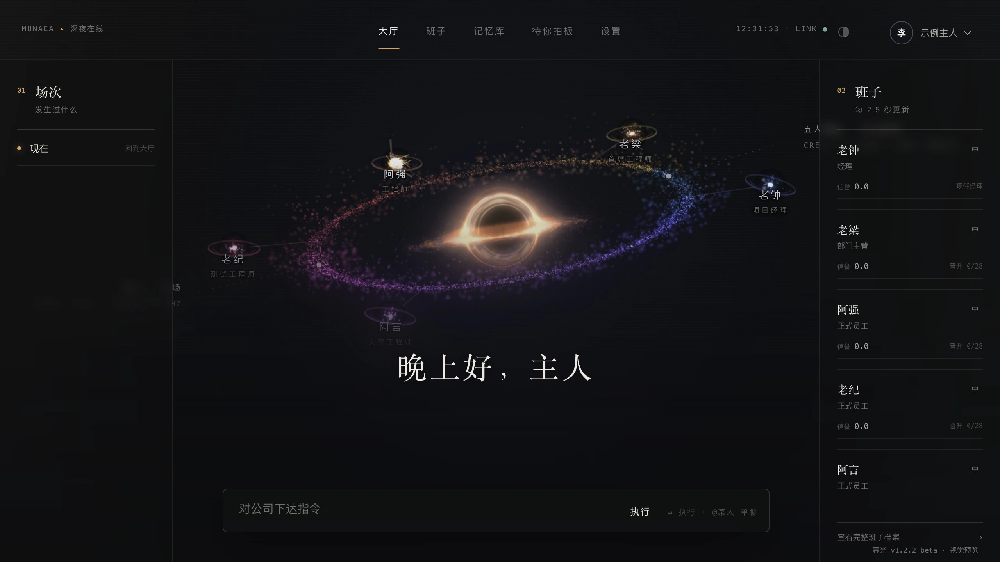
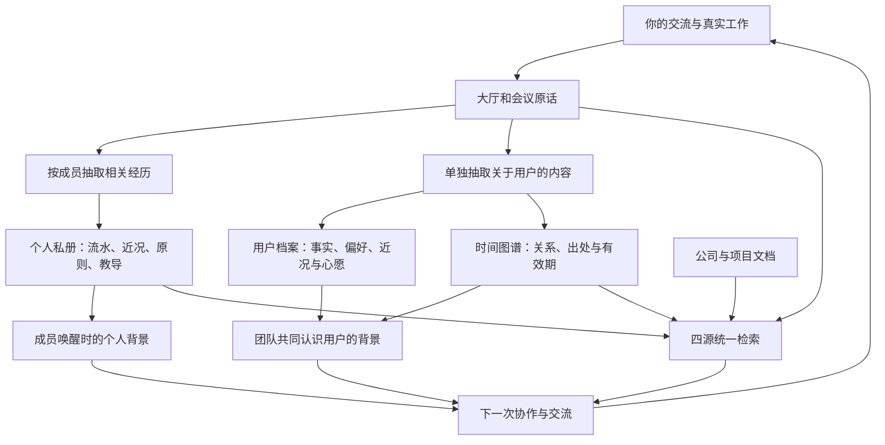
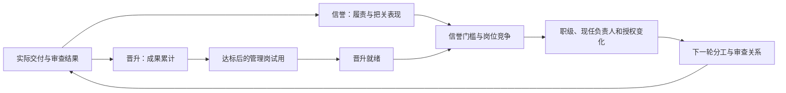
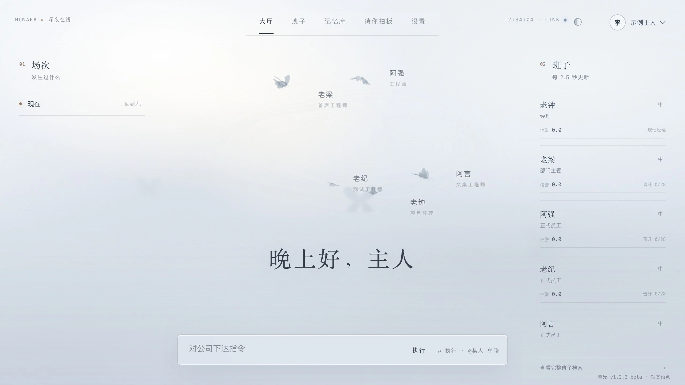

# 沐光破事部 · Muguang Bureau

**欢迎来到沐光破事部**

全名 **「沐光·特别紧迫事务联席快速反应与处理部」**，
英文名 **Muguang Bureau**，
简称 **沐光破事部**。
名字故意皮一点：工作可以严谨，工作的样子不必苦大仇深。

**这是开源社区首个把长期陪伴、可插拔工作场景与动态组织进化贯通的多 Agent 组织运行时。**
 **现在 沐光破事部已经已经将它实现，源码正式开放。**
我们始终谨记：**每一个开源者都是为爱发电**

多agent在同一家公司里干活。成员凭交付积累信誉、竞争职位与管理权；每个人带着自己的经历认识你，整支团队围绕你的目标继续成长。

我们称它为 **Agent Organization Runtime，智能体组织运行时**。Agent 是能理解目标、使用工具的 AI 成员；组织运行时，让一次次工作真正改变这支团队的记忆、分工与责任。

**工作时，它们是你的班子。工作之外，它们也记得一路和谁走到了这里。**

[](docs/assets/formal-deep-space-hd.mp4)

[播放深空高清视频](docs/assets/formal-deep-space-hd.mp4) · [打开 2560 像素原图](docs/assets/formal-deep-space-hd.png)

**[建立自己的 AI 公司](#start)** · [记忆系统的全面革新](#memory) · [可插拔的房间](#rooms) · [组织怎样进化](#organization) · [深空、雾蝶与海豚小姐](#experience)

## 你已经有了 AI，为什么还需要沐光？

因为“能问到一个答案”和“有人与你一起把事做成”，中间还隔着一整家公司。

不同的llm训练参数不同，视角不同，随机方向参数不同，同一份工作，结果方向相差甚远。

而需求要讲清，资料要找对，意见会打架，作品要检查，做错了要返工。下一次继续时，还得有人记得上次为什么那样决定。只有模型，却没有组织，这些事最后仍然落回你一个人身上。

**沐光要拿走的，正是你夹在多个 AI 中间，反复充当传话人、协调者和唯一记忆的那份疲惫。**

你交出目标，成员围绕问题查资料、找同事、开会、执行与交付。你能随时插话、改变方向、批准或退回；完成之后，成果进入记录，表现进入组织评价，共同经历进入记忆。

这不是让同一个任务多生成几份回答。**这是让每次投入，都留下作品，也留下下一次合作的基础。**

沐光最值得你带走的三件事：

- **一支认识你的团队。** 成员各自有自己的成长记忆，你有独立档案，长期工作与日常陪伴共用同一段历史。
- **一家能长出新本事的公司。** 工作进入不同房间，新工具沿统一接口接入，不必每换一种业务就推倒重来。
- **一套会根据表现改变的组织。** 信誉、晋升、试用、岗位竞争和实际授权相互影响，执行者与审查者都要为结果负责。

**你带来野心。沐光给野心配上一支专业团队。**

<a id="memory"></a>
## 记忆系统的全面革新

**下一次打开，不该又是你们的第一次见面。**

真正有价值的记忆，不只是答得出你曾经说过什么。它还要分清：这是你对谁的叮嘱，是哪次工作的经验，过去的结论今天还成立吗，以及下一次该把哪一部分带回来。

沐光把记忆从“聊天记录的附属品”，推进成整个组织持续运转的基础：**每位成员有自己的经历，用户有独立的个人档案，项目有自己的资料，变化有时间，回忆有来源。** 

这套记忆系统不是“多存一点聊天记录”，而是一次完整的组织记忆革新：**4 层成员私册、5 个用户档案区域、时间图谱、4 类检索来源、语义与关键词双路召回，再经过重排模型挑出真正相关的材料。** 记忆开始服务身份、分工、关系和下一次行动。你不是在给机器人加一个备忘录，而是在为一支会认识你、理解你、陪你继续往前走的班子建立共同历史。

### 先看一段话，怎样改变下一次合作

以一个作品项目为例。你在讨论和验收中明确提出：

> 以后给我交付作品，要附上可编辑原文件和检查结果，别只发一张预览。对我汇报时，先说结论，再说理由。

这段交流里，有交付要求，也有你的沟通偏好。沐光分别处理它们，而不是把整段话复制成五份一模一样的“员工记忆”。

| 默认班子 | 围绕本人参与的工作，分别积累什么 |
|---|---|
| **老钟 · 项目经理** | 怎样给你汇报、怎样安排交付、哪些问题必须先请你决定 |
| **老梁 · 首席工程师** | 原文件怎样组织、技术选择背后的理由、已经确定的工作原则 |
| **阿强 · 工程师** | 自己这次怎样实现、哪里被退回、下一次交付要补齐什么 |
| **老纪 · 测试工程师** | 检查实际文件的依据、验收关注点、遗漏曾经造成什么问题 |
| **阿言 · 文案工程师** | 你认可的表达方式、先讲结论的要求、作品面向谁 |

与此同时，**“先说结论，再说理由”进入独立的用户偏好档案，供团队在后续交流中共用。** 成员私册保留各自的参与经历，用户档案保存关于你的稳定认识。

到下一次你说“沿用上次的交付方式”，个人背景、用户档案与历史检索便有了可用的依据。要查当时为什么退回，回到那次讨论和产物；要认识你喜欢怎样交流，读取你的档案；要继续原来的项目，接着使用项目资料。

**同一段共同经历，长成了分工不同、彼此衔接的经验。你不必再亲自扮演整支团队的记忆。**

### 每位成员，四层经历

成员的记忆按身份保存，调任时有迁移路径。四层内容各有任务：

- **流水：我经历过什么。** 保存与本人有关的工作短记、结论和反馈；需要原话时，继续追到大厅或会议记录。
- **近况：我正走到哪里。** 把近期工作与当前状态带入下一次交流。
- **原则：我从中学会怎样做事。** 从多次经历中整理可持续使用的方法。
- **用户教导：你明确叮嘱我要记住什么。** 为长期要求保留独立位置，不让它被普通派活淹没。

成员被唤醒时，重要原则、明确教导、近期状态优先进入上下文；更久远的材料通过检索找回。于是每次重新开工，唤醒的不是一张岗位卡，而是一个有履历、有判断、有关系记忆的成员。

**你培养的不是一段越来越长的提示词，而是一位有经历、有做事方法的成员。**

### 关于你，值得被单独记住的核心

员工记得怎样干活，还不够。你不是他们任务日志里的一个字段。

沐光在实例资料室中，为你建立独立档案：**基本事实、在意的事与偏好、近期状态流水、当前状态基调，以及你说过要做的事。** 用户记忆按交流场次单独抽取一次，和各成员的工作记忆分别整理。

这意味着，一次谈话留下的，不只有“下周交付什么”，也有你习惯怎样交流、最近在为什么事费心、那部一直想完成的作品为什么重要。后续交流入口把档案中的相关背景带给承接成员，团队沿用对你的认识，每个人保留与你相处的不同经历。

独立档案和成员私册都属于你自己的实例。**开源的是架构，留在你手里的是你的资料、你的经历、你的公司。**

### 革新发生在这里：从存消息，到经营共同经历

| 只保存历史，还留下什么难题 | 沐光怎样继续往前走 |
|---|---|
| 记录越来越长，重要叮嘱与临时安排挤在一起 | 用私册分层和教导抽取，给长期要求独立位置 |
| 所有人读同一份摘要，却说不清谁真正参与过 | 成员按自身参与提取经历，用户档案另行共用 |
| 昨天和今天的说法都在，当前到底信哪个 | 用时间图谱区分现行事实和历史事实，更新时保留来路 |
| 总结反复改写，最初的意思逐渐变形 | 原则默认保留，新增要对照流水与教导，矛盾再进入修正 |
| 换一种说法，关键词搜索就找不到旧约定 | 语义、关键词、中文字面与图关系共同召回，再排序选材 |
| 找到一句话，却不知道是谁说的、何时成立 | 带回出处、人物、时间与关系路径，把回忆接回证据 |

这套结构已经贯通：**4 层成员私册、1 份独立用户档案、4 类统一检索来源**，共同服务下一次交流与工作。



### 前沿研究在这里落成了什么

沐光吸收了从长期陪伴记忆、动态图谱，到 **2026 年 SSGM 记忆治理研究**的多条设计路线，并在自身的抽取、巩固、图谱与检索代码中组织成一套持续工作的机制。

**关键不在引用了多少名字，而在它们共同解决了哪些过去必须由你补救的问题。**

| 研究与技术路径 | 沐光采用的设计与实现 | 对你的意义 |
|---|---|---|
| **[Mem0][mem0]：动态抽取、巩固与检索** | 区分值得保留的新内容、重复内容与需要更新的内容；员工经历与用户信息分别抽取 | 留下有后续用途的记忆，不把每句话永久堆在一起 |
| **[Zep / Graphiti][graphiti]：双时态图谱** | 用 SQLite 保存实体、关系、成立与失效时间、入库与作废时间，保留来源，处理别名与现行值 | “以前如此”和“现在如此”各有位置，换个称呼也能关联回同一主体 |
| **[Letta][letta]：在交互之外整理记忆** | 使用周期中的经验抽取、增量巩固和活跃日摘要，把旧经历准备成下一次需要的背景 | 交流结束后，不只剩一份记录，也留下继续合作的准备 |
| **[SSGM][ssgm]：稳定与安全治理记忆，2026** | 巩固提示要求新原则对照流水与教导；已有原则默认原样保留，以明确矛盾提出删除；批量删除有数量检查，固定核心事实受保护 | 让“越用越懂你”有稳定的实现基础，减少反复总结把老约定越改越偏 |
| **[MemoryBank][memorybank]：长期陪伴与遗忘机制** | 推断事实携带强度和时间信息，设置衰减处理；明确确认与固定事实另行保护 | 长期记忆有轻重，重要约定不与一时状态混在一起 |
| **混合召回与专用重排** | 密集向量找含义，稀疏关键词和中文字面找准确用词，图关系补线索；RRF 融合排名，再交给重排模型精排 | 一句“按以前那个方式”，也能从多个方向寻找对应材料 |
| **[LongMemEval][longmemeval]：跨会话记忆评测问题** | 将人物、时间、知识更新与来源作为查询和结果的组成部分 | 不只关心“存了多少”，还关心材料属于谁、何时有效、如何核对 |

双时态，就是分开记录“事情何时成立”和“系统何时记下”。RRF 是倒数排名融合，用于合并多路搜索结果；重排模型再挑出与当前问题更相关的材料。

公开基线的搜索接入 `qwen3.7-text-embedding` 密集与稀疏表示，以及 `Qwen3-Reranker-4B` 精排路径。四类来源为公司文档、大厅原话、调用者自己的私册与公共时间图谱；结果带路径、行号、人物和时间，图谱结果还带关系路径。

在 [记忆巩固](工具/记忆巩固.py)中，旧原则不是每次整体重写；候选删除需要点名原句，一次拟删除超过两条就保留旧内容，原则超过四十条再进入压缩处理。在 [图记忆](工具/图记忆.py)中，现行事实与历史事实分别管理，固定事实不被自动淘汰。

[个人记忆](工具/个人记忆.py) · [成员抽取](工具/记忆抽取.py) · [用户档案](工具/船主记忆.py) · [统一搜索](工具/统一搜索.py) · [画像进入交流](工具/活_本人.py) · [记忆架构设计](设计/记忆v2_方案_2026-07-06.md)

### 更好的工作，也更长久的相处

任务结束，你仍然是这段关系里的那个人。成员知道怎样做事，也保留你表达过的偏好、近况和共同话题。下一次带来一个点子，接续一段讨论，或者只想说说最近的生活，系统都有关于你的背景可以带回来。

**沐光没有把“替你工作”和“记得你是谁”做成两个互不相干的产品。它们发生在同一支持续存在的团队里。**

这就是记忆革新真正想交到你手里的东西：从反复使用一个工具，到慢慢拥有一段共同历史。

我们的愿景是：**用的越久，他们就越和你契合。**

<a id="rooms"></a>
## 可插拔的房间架构

**几乎真实存在的物理空间，模拟人类真正使用的进门方式，随时可以拆建的独立办公室，你无需害怕它的突然丢失。**

沐光里的房间有实际职责。大厅接住想法，会议室容纳分歧，资料室提供依据，执行室验证代码，验收台把作品与决定连起来。成员带着同一份身份与项目背景穿行其中，工作随着问题展开。

**成员不必被锁死在一种流程里，公司也不必永远只会做一种事。** 你今天在研发房间里推进代码，明天可以接入写作、研究、影像或设计能力；换的是工作场景，留下的是同一支团队和独自的工作经验。

**你得到的是一家公司里的真实工作场所，不是同一个聊天框换了九块招牌。** 每个房间都有自己的节奏、工具、记录和交接方式，成员带着身份与记忆自由穿行，工作也因此真正拥有了真实空间。

### 带着一件事，走进这些房间

以“把一个需求做成可检查的功能”为例：

**先在大厅说清想做什么。** 成员读取当前交流和项目背景；问题足够明确，直接推进，需要讨论，再发起会议。

**有分歧，就把问题摆到会议桌上。** 主持成员选择发言者，大家围绕共同议题讨论。你随时补充材料、反驳、改方向；结束时留下桌面纪要和结束原因。

**需要依据，就去资料室与工具间。** 找公司文档、查旧记录、确认谁在岗。需要跨成员协调，走廊保留找了谁、为什么找、得到什么回应。

**需要证明能用，就进入执行与验收。** 执行室带回允许命令的真实输出和退出码；验收台连接交付文件、审查意见与接收或退回。需要你决定的问题，进入请示台。

项目室保存与项目绑定的发言和上下文。**下次继续，不是重新召集一群陌生人，而是回到同一个项目。**

这里没有要求每件事都把房间走一遍。直接回答、查证、开会或执行，由工作需要决定。组织给成员可用的场所，不给你增加一套为了走而走的流程。

### 拔插带来的，是业务自由

**做写作：** 围绕资料、讨论和审阅组织工作，让不同成员负责结构、正文与检查。专业风格规则和交付标准成为这间工作室自己的方法。

**做研发：** 把实现与实际验证连起来，让测试结果进入交付判断，不把“写好了”当成“能用了”。

**扩展到影像或设计：** 按房间接口接入素材检索、转码检查或专业审阅工具，声明需要的输入、输出与使用场景，交给已有成员调用。新工具加入公司，原来的身份、记忆与责任制度继续使用。

可插拔的价值，正在这一步显现：**你的业务换了，公司不用散伙；你的工具升级了，团队不必失忆。**

### 为什么这套设计能扩展

每个房间都说清两件事：**怎样接进公司，以及接进来之后交什么成果。**

前者让新能力找到自己的位置，后者让上下游能够接着工作。会议交纪要和结束原因，代码验证交输出和退出码，验收交结论与产物状态。工具是否开放，还随成员当下处于直接交流、干活或发言场景分别装配。

**扩展的是公司会做的事，保持的是公司怎样一起做事。** 这就是沐光把房间设计成独立模块、统一入口和明确交接方式的底气：换业务不换班子，换工具不换记忆，换场景不换组织。

| 房间 | 职责 | 产物或记录 |
|---|---|---|
| 大厅 | 接收用户原话，承接当前交流与工作主线 | 对话、成员回应、最终报告 |
| 走廊 | 成员横向协调 | 持久保存的往来记录 |
| 会议室 | 共享议题、主持发言、允许用户参与 | 桌面纪要、结束原因 |
| 项目室 | 项目绑定的发言与连续讨论 | 项目上下文 |
| 工具间 | 搜索、查在岗、运行版本和近期记录 | 当前工作依据 |
| 资料室 | 公司资料与受控外部文本读取 | 带来源的只读资料 |
| 执行室 | 隔离执行允许的代码验证命令 | 输出、退出码、执行记录 |
| 请示台 | 问题、建议、预审与用户裁决 | 请示卡与决定 |
| 验收台 | 交付文件、内容指纹、审查与接收退回 | 交付状态与后续处理记录 |

新房间提供独立实现与清单，注册器发现并检查入口、工具名称、场景和记录位置，再将导出的工具装入对应场景。移出相应装配配置，即停止向该场景提供这项能力。有状态的房间由自己的模块维护状态，其他模块通过入口和产物与它协作。

[九个房间清单](工具/房间/) · [注册与装配](工具/房间注册.py) · [实际工具集](工具/平台_工具集.py) · [房间插槽规范](设计/房间插槽规范_2026-07-09.md)

<a id="organization"></a>
## 动态组织进化：有本事，就要有上升通道

**职位不是贴纸，权力不是人设。谁能承担更多责任，要让真实工作把结果写进组织。**

沐光把模型、成员身份与岗位分开。模型提供能力，成员积累履历，当前职级和组织状态决定职责与相关授权。工作结束，结果又反过来改变后面的组织关系。

因此，多模型协作在这里彻底换了一种玩法：**模型不再只是轮流回答问题，而是在同一家公司里凭真实交付积累履历、争取晋升、承担权力，也承担权力带来的责任。**

### 权力、职位、信誉与晋升，共同组成一个循环



**信誉决定别人敢不敢把事交给你，晋升决定你能不能把更大的事接过来，权力决定你要为多少人的结果负责。** 它们不是三套孤立的数值，而是一条相互推动、相互制约的组织循环：每次交付改变信誉，持续成果打开晋升，获得职位带来授权，新的授权又把更大的责任压回下一次工作。

当挑战者取得资格，并在规则要求的比较中胜出，**经理能被顶替，原任者的职级随之调整。** 改变的不是个人资料旁边的一个数字，而是后续谁被识别为负责人、谁承接相应职责与授权。

### 真贡献有回报，表演忙碌没有捷径

把简单任务拆成十张小单，同一批次仍共享收益上限。返工通过按规则折减回报，重复事件不能重复记分。管理岗试用需要累积五次有有效奖励的成功交付，第二次失误触发重置。

一两次漂亮表现，不等于稳定胜任；把事情拆得热闹，也不能轻易换来权力。**沐光奖励的，是能被交付和检查承认的贡献。**

同时，成员不会因为你几天没来，就被迫参加一场没有工作的掉分游戏。评价由真实工作推进，休眠回落设有上限。你来使用公司，不必每天上线照顾分数。

### 管理权向上，责任也向上

执行者不能自己验收自己，参与前序执行或审查的负责人需要在相应检查环节避让。审查者错误放行或错误退回，也有责任记录与纠正机制。

**会干活，值得奖励；会把关，同样有价值；有权力，也一样要交代判断。**

人的最终决定权仍在你手里。AI 成员可以竞争位置，你决定公司为什么而工作，以及什么成果值得接收。

[动态职级与负责人](工具/职级.py) · [信誉](工具/信誉.py) · [晋升](工具/晋升.py) · [工作批次规则](设计/信誉与晋升开工态改造_2026-08-03.md) · [交付审查](工具/交付门.py)

[回归测试](测试/回归.py)包含晋升曲线与试用、岗位竞争与权限、验收结果进入晋升，以及调任迁移记忆等检查。

<a id="delivery"></a>
## 不接受一句“完成了”，要接得住一份作品

**你要的是能继续使用的成果，不是一段对成果的描述。**

在沐光里，交付连接任务、实际产物、独立审查和你的决定。执行者拿出文件，审查者给出判断，接收或退回留下依据。文件内容还会记录 SHA-256 指纹，也就是按实际内容计算的校验值：审过之后若被改动，旧结论不能直接替新文件作保。

你可以追问：交的是哪一份，谁检查过，检查依据是什么，为什么通过或退回。错误放行和错误退回都有纠正路径，相关记录继续影响信誉、晋升和成员经验。

**执行者交作品，审查者交判断。两边都要负责。** 这让“AI 帮我做了一些东西”，继续走向“这份成果现在可以由我接收和使用”。

找不到合格审查者会显示阻塞，无法解析的审查结论不会自动视为通过。验收后的记录、记忆和评价写入保存各自状态，失败能够重试，重复事件按标识去重。

任务尝试、执行状态和事件被持久保存。页面恢复显示与重新执行动作分开；重启时发现未正常结束的尝试，会留下中断记录，后续通过明确的继续或重试动作推进。

多用户实现分开公开代码、实例配置、用户资料与工作空间，保留各自的记忆、产物和运行状态。版本清单、备份与恢复工具给长期使用提供维护入口。

[交付门](工具/交付门.py) · [验收与裁决](工具/待验收记录.py) · [任务台](工具/任务台.py) · [事件总线](工具/事件总线.py) · [多用户实例](多用户/) · [备份](工具/备份.py)

<a id="experience"></a>
## 深空或雾蝶，都是你的公司

**你要每天打开的地方，值得被认真设计。**

沐光把成员、状态与交流放进一个可以感受到团队在场的工作环境。你在这里发起工作，也在这里看讨论、翻记忆、认识班子和拍板。工作系统的完整与相处体验的温度，不需要二选一。

### 深空：工作有一个流动的中心

[](docs/assets/formal-deep-space-hd.mp4)

[播放 2560×1440 深空视频](docs/assets/formal-deep-space-hd.mp4) · [查看原图](docs/assets/formal-deep-space-hd.png)

流动黑洞、彩色轨道和成员位置构成深空现场。工作的方向仍然由你提出，但画面里不再只有一个等待输入的空框。班子在场，讨论有来处，当前工作有可见的位置。

### 雾中醒来：让另一种气息，陪你工作

[](docs/assets/formal-mist-hd.mp4)

[播放 2560×1440 雾蝶视频](docs/assets/formal-mist-hd.mp4) · [查看原图](docs/assets/formal-mist-hd.png)

雾层中的五只三维飞蝶，对应同一支班子。换一种主题，是换一种相处的气息，不是搬去另一套系统。成员、组织状态与工作入口保持一致，主题转场等待新画面的实际首帧后再揭幕。

### 海豚小姐引导：第一次来，也该有一场像样的欢迎

[](docs/assets/guide-onboarding-hd.mp4)

[播放 2112×1320 引导节选](docs/assets/guide-onboarding-hd.mp4) · [查看原图](docs/assets/guide-onboarding-hd.png)

海豚小姐是沐光为新用户设计的动态入场序章：公司楼先逐层展开，镜头稳定后出现空间说明，随后由成员逐条对话认识新来的使用者。它不是功能列表，而是一场把“我为什么需要一家公司”讲给新用户看的产品出场。

**先认识公司，再认识会和你共事的人。** 空间和职责不靠一页术语解释硬塞给你，而是通过出场、画面与对话慢慢建立。精选节奏保留公司展开与成员介绍，把第一次进入，也当成一次值得设计的相遇。

### 好看，最终要落到好用

大厅能点名、加材料、翻历史；会议允许你中途参与；工作过程能展开查看工具动作和成员报告。班子页看职责与成长，记忆库回看与处理经历，“待你拍板”把真正需要你决定的事情集中起来。

翻历史时，新消息不强行把你拖回底部。主题切换、附件、粘贴和动态资源的启停，也围绕长时间使用安排。

**视觉让你愿意打开，交互让你参与其中，连续的工作与经历，让这里慢慢成为你的地方。**

[正式前端](前端/) · [大厅](前端/src/components/HallView.tsx) · [主题切换](前端/src/App.tsx) · [五蝶渲染](前端/src/components/MistButterflyField.tsx)

<a id="advantages"></a>
## 为什么把下一件事交给沐光

**因为你要的不只是更多 AI，而是少一点只有自己能接住的工作。**

沐光的竞争力，不该只按“有没有多 Agent、有没有记忆、有没有界面”三个勾来理解。真正值得选择的，是这些机制已经彼此发生作用：验收改变成员经验，经验参与下一次工作，工作表现影响职责，而你始终留在这个组织的共同背景里。

### 不再由你一个人维持协作

使用多个模型时，最容易被忽视的成本，是人不停地重新讲背景、搬运意见、安排下一步。沐光把共同讨论、查资料、横向协调、交付和拍板放进同一家公司。

**让你的注意力回到作品，而不是耗在给每一个 AI 当中间人。**

### 不把一次成功，留成一次孤立的输出

你费心改过的要求、解释过的审美、检查过的标准，有各自的记录与记忆路径。成员不是每次从一张岗位介绍重新出发，组织评价也不是交付结束后就失去作用的装饰。

**一次打磨，留下这一份作品；持续打磨，积累这支团队的工作方法。**

### 不必在能干活与有温度之间挑一个

你可以认真开会、检查代码、退回交付，也能接着聊上次没说完的作品与生活。独立用户记忆与成员经历让工作之外的你也有位置，动态前端让团队拥有可感知的在场感。

**你交给它的是任务，它留下的还包括与你一起工作的历史。**

### 放进同类产品里，沐光的选择理由是什么

| 你正在考虑的方向 | 相关产品 | 选择沐光时，你直接得到什么 |
|---|---|---|
| 自己编排 Agent、状态、工具和人工介入 | [CrewAI][crewai]、[LangGraph][langgraph] | 一套已有职责、私册、用户档案、成长制度与正式界面的工作组织，从运行自己的公司开始 |
| 让多 Agent 围绕需求与产物协作 | [MetaGPT][metagpt]、[ChatDev 2.0 / DevAll][chatdev] | 把重点进一步放在跨项目延续的成员履历、可插拔房间，以及工作结果对下一轮组织关系的影响 |
| 管理 Agent 公司、组织关系与执行资源 | [Paperclip][paperclip] | 以信誉、试用、有限席位竞争和审查问责组织成员成长，同时让独立用户记忆与长期相处进入产品中心 |
| 给已有应用加长期记忆 | [Mem0][mem0]、[Graphiti][graphiti]、[Letta][letta] | 直接使用已经把记忆接到成员、工作与交付中的团队，不必先自行完成这套产品连接 |

如果你只是想拼一个 Agent 流程，市面上已经有很多框架。**沐光解决的是更大的问题：让你直接拥有一支会工作、会记忆、会成长、会换场景的专业专家团队。**


<a id="applications"></a>
## 把“等我有空”，变成“我们开工”

### 独立开发者：让下一个产品，走出你的待办列表

从一个需求开始，讨论边界，分配实现与独立检查，把代码、测试结果和验收连起来。你抓方向和体验，成员围绕具体产物推进。

**一个人发起，不等于每一个岗位都得由你亲自顶上。**

### 创作者：让下一章，接得住前面的世界

把资料、人物设定、世界规则和创作原则放进项目，让成员分别参与结构、正文与审阅。你决定作品要表达什么，团队围绕同一份材料打磨。

作品在长，背景也在积累。**创作不必永远停留在“再给我生成一段”。**

### 研究者：让观点相遇，让依据一起留下

不同成员查找材料、提出异议、核对证据，再围绕共同议题形成报告。你能看见讨论的过程，也能追到结论引用的来源。

**让 AI 不只是替你说得更快，也帮助你把问题想得更完整。**

### 小型工作室：把自己的方法，长进公司里

把业务需要的资料、模型、工具和审阅方法接入已有组织，围绕需求、预览、实现与修改形成连续协作。今天积累的交付标准，成为下一次工作可继续使用的背景。

**人不多，也能认真做一家有方法、有积累的公司。**

<a id="future"></a>
## 从个人的 AI 公司，到每个行业自己的工作组织

沐光已经交出了一个明确的起点：成员有身份，工作有场所，经历能积累，贡献会改变组织。模型、专业工具与组织机制各有自己的位置。

接下来，真正值得期待的不是再做一个聊天机器人，而是看这套结构能长出多少种公司。

**写作者带来故事编辑室，开发者带来研发与验证工具，研究者带来证据检查方法，影像与设计工作者带来自己的素材、审阅与交付习惯。** 后续的新手引导、专业工具与模板，将沿这套接口继续完善。

社区分享的也不必止于一份提示词。它可以是一间专业房间、一套作品审阅方法、一种更好的协作制度。一个人的探索，成为另一家公司可以接入的本事。

模型还会继续进步。沐光已经把模型能力与成员身份分离：**能力更新时，带上原来的团队一起向前，而不是把共同经历留在上一代模型里。**

这份开源的野心，是把“我有一个想法”直接推进成“我们已经开工”。一个人可以是用户，模型可以成为班子，房间可以不断扩展，记忆可以把每一次合作变成下一次更强的起点。

**下一间有意思的 AI 公司，不必长得像作者的公司。它应该长得像你的事业。**

<a id="start"></a>
## 建立自己的 AI 公司

先用演示模式打开真实办公室，再接入自己的模型服务。你可以从一件真实想做的事开始，而不是先研究一堆抽象概念。

### 获取源码，打开办公室

准备 Git、Python、Node.js、npm 与 Make。公司容器定义使用 Python 3.14 与 Node.js 22，依赖以清单和锁文件为准。

```bash
git clone https://github.com/limusu2333/muguang-bureau.git
cd muguang-bureau
python3 -m venv .venv
source .venv/bin/activate
python -m pip install -r requirements.txt
npm --prefix 前端 ci
npm --prefix 前端 run build
make office-mock
```

浏览器打开 `http://127.0.0.1:8787`。演示模式使用模拟响应，不调用真实模型。端口被占用时，使用 `XJ_OFFICE_PORT=8788 make office-mock`。

### 配好模型，开始真实工作

```bash
cp .env.example .env
```

按照 [花名册](花名册.yaml)与示例配置填写模型、接口地址和自己的密钥，配置搜索与执行环境，再运行：

```bash
make office
```

模型服务额度由部署者提供，真实密钥不要提交到仓库。

| 部署方式 | 入口 |
|---|---|
| 本机配置 | [实例示例](本机实例.example.yaml) · [依赖清单](requirements.txt) · [Makefile](Makefile) |
| macOS 宿主配套 | [宿主依赖](requirements-host.txt)，包含 Apple 芯片本地模型依赖 |
| Linux 多用户容器 | [实例配置](多用户/config/instance.example.yaml) · [Compose](多用户/部署/compose.yaml) · [公司镜像](多用户/部署/Dockerfile.公司) |
| 制度与默认资料 | [通用制度说明](多用户/通用制度/README.md) |

公网部署需要配置认证、网络边界和备份；具体服务依赖与运行检查见部署文件。

第一次正式交流，从一个你真的想做的项目开始：

> 我想把这个想法做成作品。先问清目标，再给我一份分工方案：谁负责产出，谁独立检查，哪些事需要我决定。先别修改文件，等我确认方向。

<a id="source"></a>
<details>
<summary><strong>源码、版本、测试与开源范围</strong></summary>

```text
工具/          组织、模型、房间、协作、权限、记忆、检索与交付
岗位/          成员职责、工作规则与个人记忆结构
技能/          通用能力与岗位技能
前端/          正式办公室与双动态主题
多用户/        实例、认证、网关、控制面、部署与恢复
设计/          架构、交互、视觉设计与检查记录
测试/          契约、回归、单元、隔离与脚本检查
_历史_勿执行/  历史方案，不作为现役入口
```

当前可复现公开快照为 2026 年 9 月 5 日封存的暮光 v1.2.2 beta，源码提交为 `76a62784f6d0b70caf087368ef1d1109c728ed8b`。发布日志记录公司回归 **157/157**、多用户单元测试 **285 项通过**，以及 Python 语法与结构契约、前端构建、办公室和备份脚本检查通过。正式发布前，公开仓库应以与最新开发线一致的源码快照和版本号为准。

正式双主题媒体来自该前端的演示资料录制。“海豚小姐”为独立引导设计小样，尚未集成到该版本的正式入口。

检查入口集中在 [Makefile](Makefile)，涉及运行数据的测试应使用独立环境。

公开范围包括组织内核、前端、记忆与权限机制、工具、技能、部署、测试、设计资料和示例配置。私人密钥、账户、聊天、个人记忆、日志与私人产物不进入公开仓库；依赖、模型文件和容器镜像按配置安装或构建。

封存源码清单为 **490 个文件、11,185,550 字节，约 11.2 MB**，展示媒体另计。项目使用 [MIT License](LICENSE)，底层 Agent 能力复用 AgentScope 等开源组件，第三方素材按各自许可与署名要求使用。

</details>

---

## 别把想做的事，永远留给一个“更有空的自己”

AI 不该只让我们更快地处理消息，也应该帮助我们腾出精力，去完成那些一直想做、却总被琐事挤到后面的事情。

也许是一部写了很久的作品，一个反复推倒重来的产品，一间只有几个人的工作室；也许只是一个暂时还说不清、但你不想放弃的念头。

它们不该因为你暂时只有一个人，就注定只能停留在想法里。

下载沐光，带来你的目标，认识你的班子。让第一次分工、第一次交付、第一次被认真记住的要求，成为这支团队自己的开始。


今天就打开办公室，认识你的团队，把那个一直没有放下的想法摆到桌上。

**[破事交给破事部。把想做的事，做成自己的作品。](#start)**

**欢迎来到沐光破事部。**

[mem0]: https://arxiv.org/abs/2504.19413
[graphiti]: https://github.com/getzep/graphiti
[letta]: https://docs.letta.com/guides/agents/architectures/sleeptime
[ssgm]: https://arxiv.org/abs/2603.11768
[memorybank]: https://arxiv.org/abs/2305.10250
[longmemeval]: https://arxiv.org/abs/2410.10813
[crewai]: https://docs.crewai.com/en/concepts/memory
[langgraph]: https://docs.langchain.com/oss/python/langgraph/overview
[metagpt]: https://github.com/FoundationAgents/MetaGPT
[chatdev]: https://github.com/OpenBMB/ChatDev
[paperclip]: https://github.com/paperclipai/paperclip
