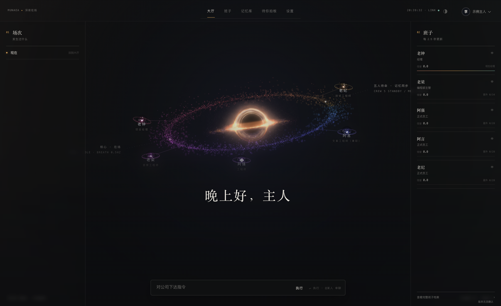
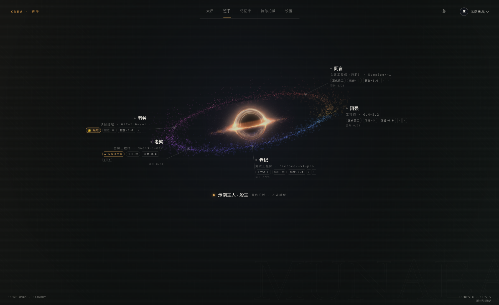

# 沐光破事部 · Muguang Bureau



> 上图由“暮光 v1.2.2 beta”封存源码在隔离演示环境运行后截取，使用空白演示数据并替换个人称呼；是正式前端的运行画面，不是正式账号的工作记录，也不是设计母版。

沐光破事部是一个把 **多 Agent（多个有明确岗位的 AI 协作者）** 做成“公司”的开源 AI 工作组织平台。它不是给聊天机器人套一层网页，也不是把几次模型调用拼成流水线，而是让 AI 具备岗位、职责、记忆、汇报、权限、交付和恢复边界；人仍然是最终决策者。

## 界面与预览入口

仓库里同时保留了正式产品和设计研究，必须区分：

| 内容 | 是什么 | 能不能当作正式产品界面 |
|---|---|---|
| `前端/index.html` 与 React 应用 | 正式办公室界面：大厅、班子、记忆库、待你拍板、设置 | **可以** |
| `前端/butterfly.html` | 单只雾蝶的独立视觉验飞页，用于验证飞行模型、姿态和资源生命周期 | 不是办公室入口，是独立实验页 |
| `设计/*动态预览*.html` | 交互设计预览和视觉母版，用来试验开机幕、光环、打板等表达 | **不可以**，不能冒充正式界面 |

正式入口与独立实验页均随源码保留，动态预览在文末单独列出。

## 当前公开版本

- 发布名称：**暮光 v1.2.2 beta版**
- 发布基线：`76a62784f6`
- 封存源码清单：490 个文件，11,185,550 字节，约 11.2 MB；不含本 README 新增的展示图片
- 发布验收：Python 语法、结构契约、公司隔离回归、多用户单元测试、前端依赖安装、前端生产构建、办公室启动脚本、备份脚本均通过

GitHub 上公开的是源码和可替换的示例配置，不包含 Docker 镜像、模型文件、真实密钥、真实账户卷、日志、数据库或个人运行状态。正式运行环境的镜像体积约 1 GB，那是运行时资产，不是 GitHub 源码仓库体积。

## 正式前端实拍

### 大厅：把“公司在不在场”直接呈现出来

大厅不是聊天记录列表。左侧是历史场次，中间是工作现场和当前核心，环上的五个成员节点对应不同岗位，右侧实时显示班子状态，底部保留对公司下达指令的入口。深空光环不是装饰背景，它是团队状态、成员节点和工作场的视觉语法。

### 班子：岗位、模型、信誉和晋升状态同时可见



班子页把“谁负责什么”从提示词里拿出来，变成可检查的组织状态：项目经理、首席工程师、工程师、文案工程师、测试工程师各自有岗位和权限，模型只是岗位的执行能力，不是组织本身。

### 记忆库与人工拍板

记忆库支持查看和处理记忆，待拍板页汇集需要人决定的事项。两页的隔离环境目前都是空状态，因此不把大幅空页堆成产品展示：[记忆库空状态](docs/assets/formal-memory-empty.png) · [待拍板空状态](docs/assets/formal-approval-empty.png)。这些截图不能证明真实模型已经完成工作流程。

## 这套系统真正解决了什么

### 1. 从“几个模型”变成“一个有制度的组织”

常见多 Agent 项目解决的是路由：把问题分给几个模型，再把答案拼回来。沐光继续解决了组织层的问题：岗位、职责、汇报链、会议语义、任务登记、权限白名单、人工拍板、交付验收和责任归属。成员可以并行工作，也可以互相质疑、澄清、派活和回收结果，而不是五个模型轮流复读。

### 2. 从“模型说完成”变成“交付可以被验收”

任务不是一句自然语言结束就算完成。系统把任务、工作记录、文件、校验、审批、打回、返工和归档连起来；失败要显性失败，不能用空成功掩盖；事件先落盘再广播，重启和恢复有边界。

### 3. 从“摘要文件”变成可治理的长期记忆

记忆系统不是简单接一个向量数据库。它同时处理：事实是谁的、什么时候发生、现在是否有效、原话在哪里、是否冲突、是否有权限、是否应该遗忘，以及模型能否拿它作为证据。

核心结构包括：

- **原话流水**：按会话保留出处，是不能被摘要替代的底层事实。
- **四个记忆抽屉**：流水、近况、原则、主人亲口叮嘱；不同可信度和生命周期不混在一起。
- **图谱事实**：用“谁—关系—值”表达结构化事实，支持单值关系、有效时间和失效非删除。
- **归一与归属**：不同称呼归到同一主体；主人记忆、员工私册和公共资料不互相串线。
- **四源统一搜索**：公司文档、大厅原话、当前调用者私册、公共图谱统一检索，混合召回、重排、合证据，搜索失败也要报告失败来源。
- **时间双轴**：`valid_at` 表示事情实际生效的时间，`created_at` 表示记录进入系统的时间，避免旧事冒充新事。
- **失效不等于删除**：换住址、换设备、改偏好时，旧值保留历史并标为失效，查询“现在”只返回当前事实。
- **防误固化**：气话、随口话和错误教导不能直接升级成长期原则；流水有据、边界通过，才允许进入更高层记忆。
- **增量巩固与防漂移**：原则不被每次摘要重写；只有新证据明确反驳时才修正，避免“微辣”慢慢漂成“无辣不欢”。
- **统一删除、幂等与并发保护**：同一事实跨图谱和档案一起处理；重复写入不重复记账；并发确认不能双执行。

配套的两张架构参考图来自仓库中保留的设计文档，已经重新渲染中文并替换个人示例。它们是设计基线说明，不替代当前源码和发布验收：

- [记忆系统全图（2400 像素宽 PNG）](docs/assets/memory-system-overview-hires.png) · [可缩放 HTML，下载后打开](docs/assets/memory-system-reference.html)
- [记忆五道闸（2400 像素宽 PNG）](docs/assets/memory-gates-hires.png) · [可缩放 HTML，下载后打开](docs/assets/memory-gates-reference.html)

这里的“五道闸”不是宣传词，而是写入归一、主体归属、遗忘收口、统一删除、防错误固化五类边界的落地施工图。

## 雾蝶与视觉系统：正式主题和独立验飞要分开看

正式大厅有深空主题；源码里还保留“雾中”视觉主题，五只雾蝶共享同一套人员节点语义和 WebGL（浏览器 3D 图形接口）渲染底盘。单只验飞页则是独立实验入口，不连接正式大厅后端。

这一部分不是随便放一个蝴蝶 GIF：

- 实测并纠正模型坐标轴，避免翼展轴被误当成飞行方向。
- 使用真实蒙皮网格和骨骼动画，而不是只让图片按 `sin(time)` 摆动。
- 在拍翼之外补上扭转（feathering，改变翼面迎角）和扫掠（sweep，改变翼面前后运动），让受力方向和运动方向有因果关系。
- 位置由速度和受力积分推进，不按曲线时间直接瞬移；滑翔、加速、转弯和下沉可以被连续观察。
- 页面不可见、主题切走或减少动态时停止或降频，并释放 Three.js 资源。

相关入口：[`前端/butterfly.html`](前端/butterfly.html)、[`设计/雾蝶飞行_查证与实测记录_2026-07-17.md`](设计/雾蝶飞行_查证与实测记录_2026-07-17.md)、[`前端/src/components/MistButterflyField.tsx`](前端/src/components/MistButterflyField.tsx)。

## 项目的独特定位

本项目的重点是把下面这整组能力作为一个**可运行、可测试、可部署、可恢复的开源 AI 工作组织**一起交付：

> **岗位化多 Agent + 组织制度 + 长期记忆治理 + 可视化工作现场 + 人工拍板 + 交付验收 + 多用户隔离 + 备份恢复。**

可核对的差异不止是功能数量，而是这些能力怎样一起工作：岗位权限约束执行，执行产生可追踪的交付，交付进入验收，验收结果进入组织状态和记忆；发生故障时，状态和发布边界仍有记录。是否可以称为行业“首个”，需要另列公开项目检索范围与对比证据；仅靠本仓库不能证明全网不存在同类实现。

## 可以怎么用

- **软件研发**：需求拆解、架构、实现、测试、审查、发布和回滚。
- **研究调查**：资料分工、证据链、冲突核验、长周期研究记忆。
- **写作与内容生产**：世界观、角色、素材、版本、审稿和连续创作。
- **产品与交互设计**：需求、预览、实现、验收和迭代记录放在同一现场。
- **个人长期项目**：让项目记住规则、历史和未完成事项，同时允许纠错和恢复。
- **多用户 AI 工作室**：每个实例拥有独立账户、记忆、工作区和运行状态。

## 快速开始

### 先跑演示模式

演示模式不需要真实模型密钥，可以先体验正式界面和公司流程：

```bash
python3 -m venv .venv
source .venv/bin/activate
pip install -r requirements.txt
pip install -r requirements-host.txt
npm --prefix 前端 ci
npm --prefix 前端 run build
make office-mock
```

打开 `http://127.0.0.1:8787`。

### 接入真实模型

1. 复制 `.env.example` 为 `.env`。
2. 填写自己的模型 API 密钥和地址，`.env` 不要提交到 Git。
3. 按 `花名册.yaml` 配置岗位和模型。
4. 运行 `make office`。

多用户部署见 [`多用户/通用制度/README.md`](多用户/通用制度/README.md)、[`多用户/config/instance.example.yaml`](多用户/config/instance.example.yaml) 和 [`多用户/部署/compose.yaml`](多用户/部署/compose.yaml)。

## 代码地图

```text
工具/             公司核心运行逻辑：会议、任务、记忆、权限、交付、搜索、状态
岗位/             岗位职责、工作宪法和岗位记忆
技能/             通用技能与岗位技能
大厅/             工作现场和公司规则
多用户/           实例隔离、认证、网关、控制面、部署与恢复
前端/             React + TypeScript + Three.js 正式工作界面
设计/             架构设计、视觉预览、压测记录与记忆系统图
测试/             回归、契约、单元、部署、隔离与脚本检查
_历史_勿执行/     历史方案与反例，不是现役入口
```

## 质量与边界

2026 年 9 月 5 日的封存发布日志记录：公司回归 157/157、多用户单元测试 285/285、前端生产构建和启动/备份脚本检查均通过。这是该发布快照的验收记录，不是本次截图工作重新运行完整测试的结果。部署者须使用自己的凭据、模型服务和实例配置。

这是 beta 版本。源码包含组织、记忆、权限、交付、前端工作现场和恢复实现；不同模型供应商、操作系统、显卡和公网环境仍需在部署现场验收。

## 设计预览（不是正式界面）

下面这些文件是设计研究和交互母版，价值在于记录视觉探索，不代表正式入口：

- [`设计/光环_动态预览_母版.html`](设计/光环_动态预览_母版.html)
- [`设计/开机_动态预览_母版.html`](设计/开机_动态预览_母版.html)
- [`设计/打板_动态预览_母版.html`](设计/打板_动态预览_母版.html)

## 许可证

本项目使用 MIT License。前端中的第三方模型素材按各自许可证和归属文件使用，请同时阅读对应目录里的许可证说明。
